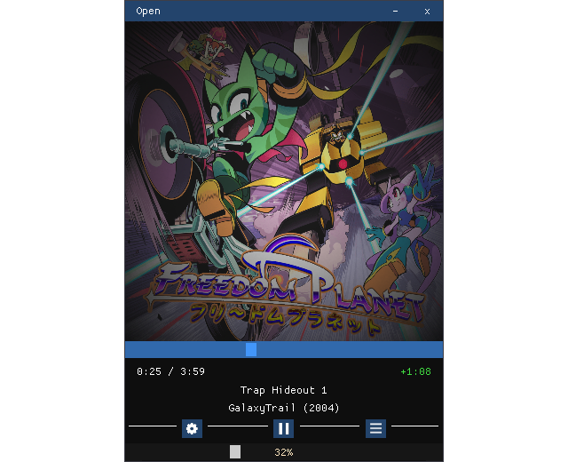

# A Qick Music Listener

  

*Central image from the ablum of freedom planet 1.*

## Library

- [FMOD Core API](https://www.fmod.com/docs/2.03/api/core-api.html)
- [DearImGUi](https://github.com/ocornut/imgui)
- [tinyfiledialogs](https://github.com/native-toolkit/libtinyfiledialogs)
- [GLFW](https://www.glfw.org/)
- [GLEW](https://glew.sourceforge.net/)

 

- [CMake](https://cmake.org/)
- [VCPKG](https://vcpkg.io/en/)

## TODO

- List
- Parameter
- Complet this file.